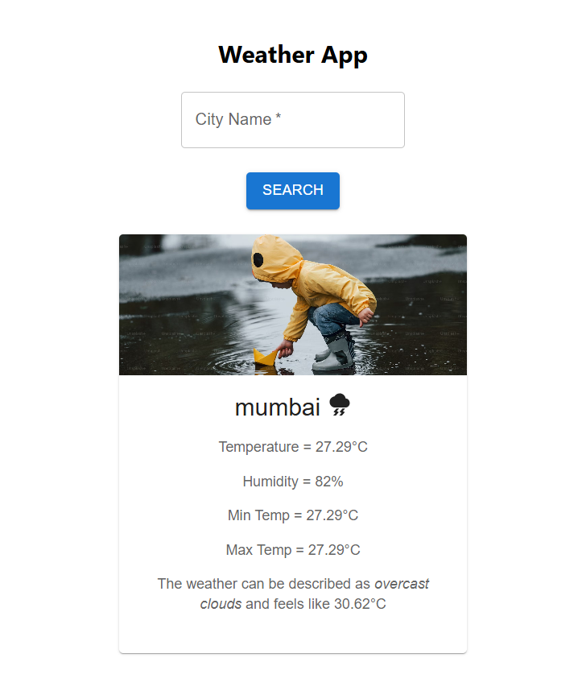

# 🌤️ Weather App

A beautifully designed and responsive Weather App built with **React** and **Material UI**, allowing users to search for real-time weather updates using the **OpenWeatherMap API**. The UI dynamically adjusts based on temperature and humidity with visually appealing cards, icons, and responsive layout.

---

## 📸 Preview


<p align="center">
  
</p>

---

## 🔧 Tech Stack

| Technology       | Purpose                        |
|------------------|--------------------------------|
| React            | Front-end UI framework         |
| Material UI      | UI components and styling      |
| OpenWeatherMap   | Weather data API               |
| Vite             | Front-end build tool           |
| JavaScript (ES6) | Programming language           |
| CSS              | Custom styling and layout      |

---

## 🚀 Features

- 🔍 **Search by city name**
- 🌤️ **Current temperature, min/max, humidity, "feels like"**
- 🖼️ **Dynamic background images based on weather**
- ❌ **Error handling** for invalid cities
- 🎨 **Clean and modern UI** with Material UI
- 📱 **Mobile responsive** layout

---

## 📁 Project Structure

src/
├── App.jsx
├── WeatherApp.jsx
├── SearchBox.jsx
├── InfoBox.jsx
├── main.jsx
├── index.css
├── WeatherApp.css
├── SearchBox.css
├── InfoBox.css


---

## 🔑 Setup Instructions

### 1. Clone the Repository

```bash
git clone https://github.com/ShatyamYograj/weather-app.git
cd weather-app
2. Install Dependencies

npm install
3. Get Your OpenWeatherMap API Key
Visit https://openweathermap.org/api

Sign up and generate your API key

Replace the placeholder in SearchBox.jsx:


const API_Key = "your_openweather_api_key";
4. Run the Development Server

npm run dev
Visit: http://localhost:5173

📦 Production Build

npm run build
✅ Best Practices Followed
Functional component structure using React hooks (useState)

Organized file structure and modular design

Clean separation of logic, UI, and styling

API error handling with user-friendly feedback

Responsive and accessible design principles

💡 Future Enhancements
🌍 Auto-detect user's location for weather on load

📅 Show 5-day forecast

🌙 Dark mode toggle

🌐 Multi-language and °C/°F unit switch

📤 Deploy on Vercel or Netlify

🧑‍💻 Author
Shatyam Yograj
Information Technology student | Web & Software Developer

📄 License
This project is licensed under the MIT License — free for personal and commercial use.

⭐ Found this project useful?
Give it a ⭐ on GitHub to show support!
